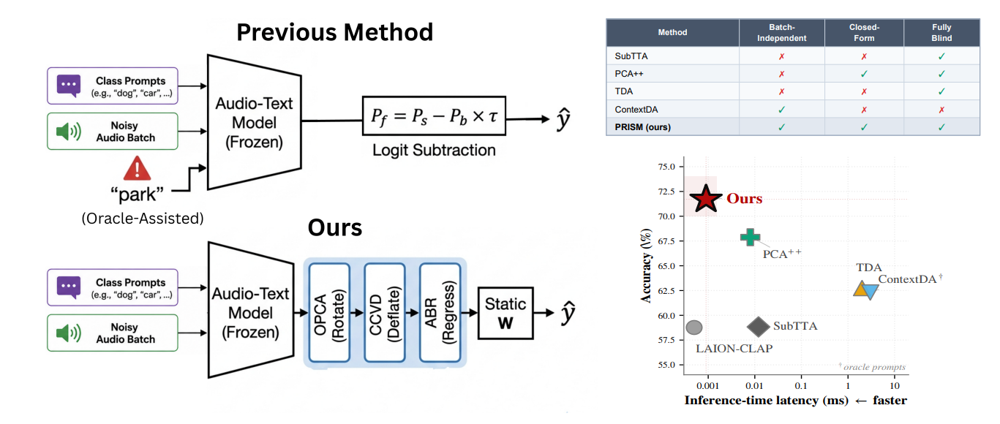

# PRISM: Prototype-Rectified Iterative Self-supervised Manifold Denoising

Official implementation of the CIKM 2026 paper:  
**"Prototype-Rectified Iterative Self-supervised Manifold Denoising under Severe Acoustic Shift"**

Developed at the **VisDom Lab (Visual Data Computing Group)**, Department of Data Science and Engineering (DSE), Indian Institute of Science Education and Research (IISER) Bhopal.



---

## Setup

**Clone and install**
```bash
git clone https://github.com/Ashish-1108/AudioText-PRISM.git
cd AudioText-PRISM
pip install -r requirements.txt
```

**Download the LAION-CLAP model**
```bash
mkdir -p models
wget -P models https://huggingface.co/lukewys/laion_clap/resolve/main/630k-audioset-fusion-best.pt
```

**Download datasets**

See [data/README.md](data/README.md) for download links (US8K, ESC-50, TAU 2019).

---

## Create Noisy Soundscapes

Mix foreground audio with TAU Urban Acoustic Scene backgrounds using [Scaper](https://scaper.readthedocs.io/):

```bash
python data/inject_noise.py \
    --folds 1,2,3,4,5,6,7,8,9,10 \
    --parameters "ref_db=-36 seed=123 snr_dist=(uniform,6,10) bg=street_traffic"
```

Repeat for each background: `airport, bus, metro, metro_station, park, public_square, shopping_mall, street_pedestrian, street_traffic, tram`

---

## Extract Audio Embeddings

```bash
# Clean audio
python scripts/extract_embeddings.py \
    --audio_dir data/input/urbansound8k/audio \
    --output_path data/embeddings/urbansound8k_clean.pt \
    --dataset us8k

# Noisy audio (one per background)
python scripts/extract_embeddings.py \
    --audio_dir data/input/urbansound8k_street_traffic \
    --output_path data/embeddings/urbansound8k_noisy_street_traffic.pt \
    --dataset us8k
```

---

## Classify Audio Files (Direct Usage)

Run PRISM directly on a folder of `.wav` files — no pre-computed embeddings needed:

```bash
python scripts/classify.py \
    --audio_folder path/to/your/audio \
    --class_labels demo/us8k_labels.txt
```

---

## Reproduce Paper Results

```bash
python examples/example_us8k.py    # UrbanSound8K
python examples/example_esc50.py   # ESC-50
```

---

## Quick API Usage

```python
from prism import prism, deploy
from prism.prompt_ensemble import get_multi_prompt_text_features

# Build text prototypes (once)
label_map = {0: 'air_conditioner', 1: 'car_horn', ..., 9: 'street_music'}
T = get_multi_prompt_text_features(label_map, clap_model)

# Calibrate on a batch (no labels needed)
E_denoised, W = prism(E_noisy, T, n_classes=10)

# Deploy on new samples instantly (~0.0009 ms/sample)
E_clean = deploy(E_new_sample, W)
prediction = (E_clean @ T.t()).argmax(dim=1)
```

---

## Citation

```bibtex
@inproceedings{prism2026cikm,
  title     = {Prototype-Rectified Iterative Self-supervised Manifold Denoising
               under Severe Acoustic Shift},
  booktitle = {Proceedings of the 35th ACM International Conference on
               Information and Knowledge Management (CIKM)},
  year      = {2026}
}
```

---

Noise injection pipeline adapted from [AudioText-ContextDA](https://github.com/eacevedo1/AudioText-ContextDA) (Apache-2.0).
